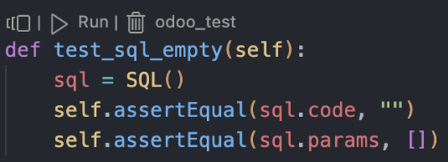
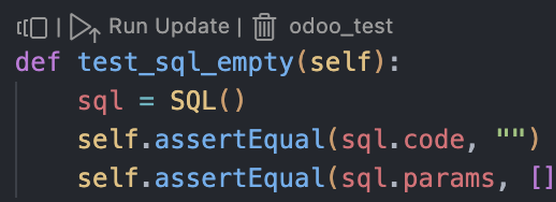
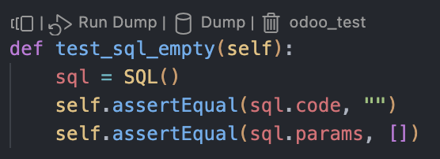
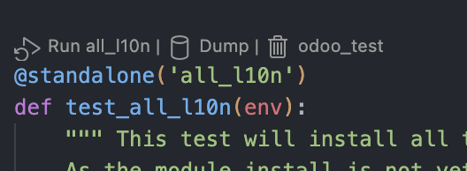
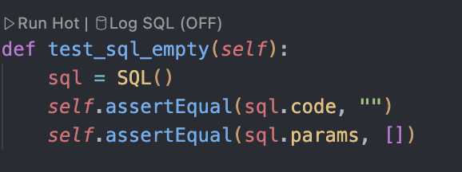
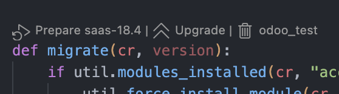
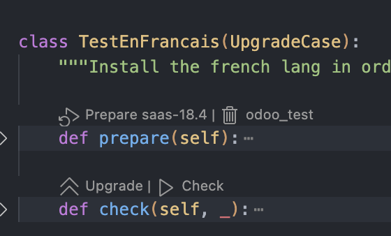

# Odoo Test VSCode Extension

  

A Visual Studio Code extension designed to streamline Odoo module test development, database management, and upgrade
testing workflows.

## Features

### Addons Test

- **Automatic Detection**: Automatically detects Odoo test files and identifies test classes and methods
- **Run Test Buttons**: Provides "Run Test" buttons above each test method for quick execution
- **Multiple Test Modes**: Supports standard tests, update tests, and dump tests with easy mode switching

  
  
  

- **Standalone Tests**: Special support for `@standalone` decorated test functions with tag-based execution

  

### ⚡ Hot Test
- **Start**: Open the Command Palette (Ctrl + Shift + P) and run "Odoo Test: Start Hot Test".
- **Run tests**: Click the "Run Hot" CodeLens above a test class or any method starting with `test`.
- **Auto reload**: Hot Test automatically reloads the Python test module. No need to restart Odoo after changing test code.
- **Fast iteration**: Save your changes and click "Run Hot" to immediately re-run for rapid feedback.

  

### 🔄 Upgrade Test
- **Upgrade Script Support**: Detects and provides execution buttons for upgrade scripts in upgrade paths

  

- **Upgrade Workflow**: Streamlined prepare → upgrade → check workflow for upgrade tests

  

- **Branch-based Upgrades**: Support for upgrading from specific branches

### 🗄️ Database Management
- **Test Database Operations**: Easy database creation, cleanup, and management
- **Database Dumping**: Quick database dump functionality for backup and analysis
- **Database Cleanup**: Drop database and relevant dump files
- **Configuration Management**: Centralized database name and upgrade source configuration
- **Note**: The extension uses one database at a time according to the config `odooTest.databaseName`.
  Standard tests, standalone tests, and upgrade tests use different dump files separately.
  The cleanup process will drop the database as well as all dump files for the current test category.
  The test flow will always try to reuse the current database and existing dump files to speed up the process.

## Installation

1. Download the `.vsix` file from the releases
2. In VSCode, go to Extensions (Ctrl+Shift+X)
3. Drop the downloaded `.vsix` file

## Configuration

### Required Settings

The extension will attempt to auto-detect most paths, but you may need to configure:

- **`odooTest.odooBinPath`**: Path to the `odoo-bin` executable
- **`odooTest.addonsPath`**: Array of paths to Odoo addons directories
- **`odooTest.upgradePath`**: Array of paths to upgrade directories (for upgrade testing)

### Optional Settings

- **`odooTest.databaseName`**: Test database name (default: `odoo_test`)
- **`odooTest.upgradeFrom`**: Branch name for `odooTest.addonsPath`'s git repo to automatically checkout to when prepare
database for upgrade.
1. `odooTest.upgradeFrom` must follow Odoo branch name conventions.
2. Users have to promise `git checkout BRANCH_NAME` command work locally.
3. If the `odooTest.upgradeFrom` branch is not available in an addonsPath's git repo, the test flow will try its corresponding Odoo stable branch name.
- **`odooTest.configPath`**: Path to Odoo configuration file. Can be used to add more customized odoo configurations.

### Auto Configuration

Run the "Reset Paths" command to automatically detect and set paths:
1. Open Command Palette (Ctrl+Shift+P)
2. Type "Odoo Test: Reset Paths"
3. The extension will scan your workspace and set appropriate paths
